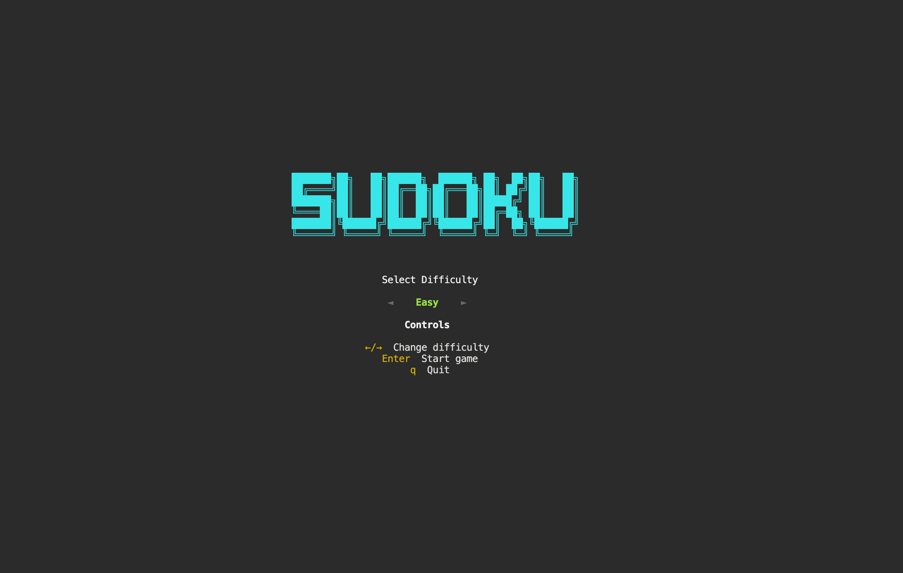
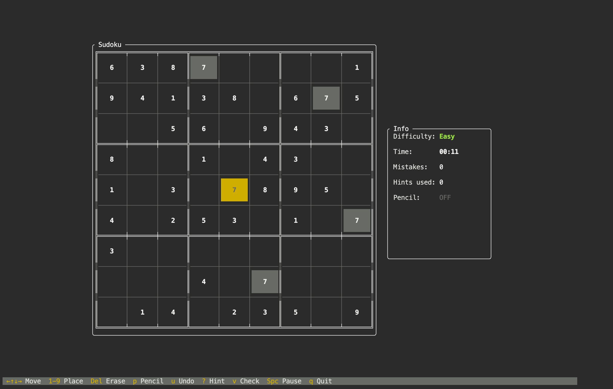
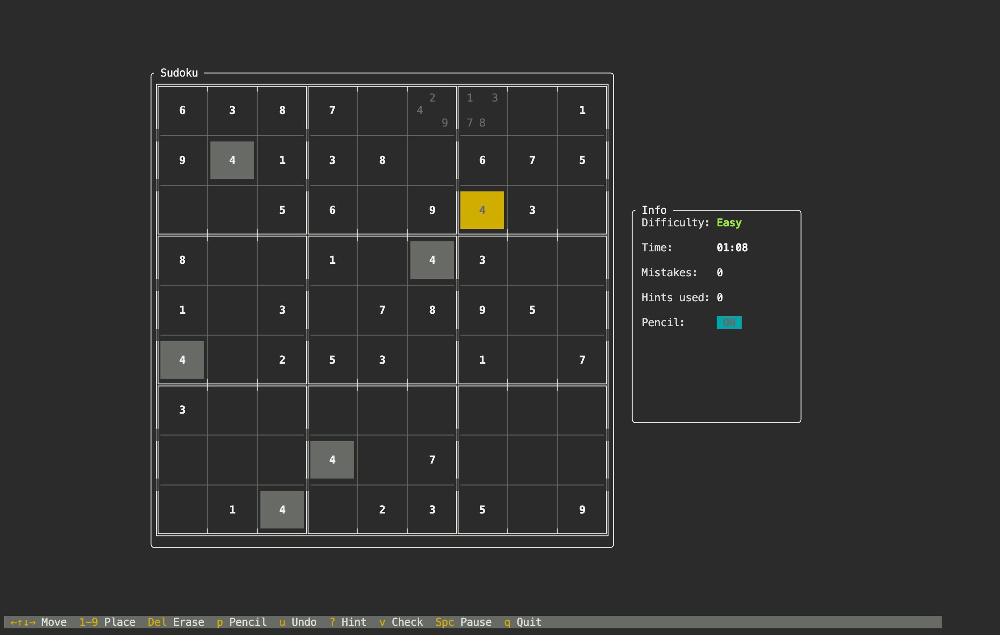
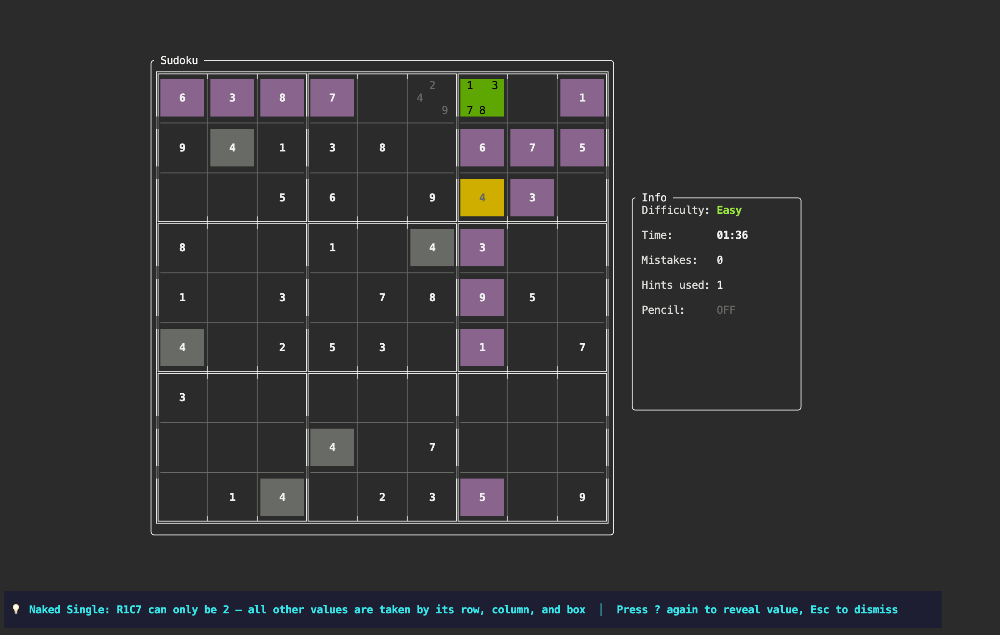

# Sudoku TUI

A beautiful terminal-based Sudoku game with **competitive multiplayer** — built with [Ratatui](https://ratatui.rs/) in Rust.



## Features

### Single Player
- **Puzzle Generation** — Every puzzle has a unique solution, generated with a backtracking algorithm. Four difficulty levels from Easy to Expert.
- **Pencil Marks** — Toggle pencil mode and mark candidates in a tic-tac-toe mini-grid layout inside each cell.
- **Visual Hints** — Step-by-step hints that highlight relevant cells, explain the solving technique (Naked Single, Hidden Single), and reveal the answer progressively.
- **Validation** — Check your board for conflicts at any time. Errors are highlighted in red.
- **Undo** — Full move history. Undo any placement, erasure, or pencil mark.
- **Timer & Stats** — Track your time, mistakes, and hints used. Pause anytime.

### Multiplayer
- **Race Mode (1v1)** — Same puzzle, separate boards. First to solve correctly wins. See your opponent's progress as a shadow grid and momentum indicator.
- **Shared Board Mode (1v1)** — Same puzzle, same board. Most correct cells placed wins. First-write-wins conflict resolution. See your opponent's cursor in real-time.
- **ELO Rankings** — K=32 rating system starting at 1200. Matchmaking pairs players within similar skill ranges.
- **Leaderboard** — Top 100 players by rating with win/loss records.
- **Room System** — Create private rooms with a 6-character code, or quick match for instant pairing.
- **GitHub Identity** — Log in via GitHub device flow. No passwords, no email.

## Screenshots

### Gameplay



### Pencil Marks

Pencil marks display as a 3x3 mini-grid inside each cell — each digit sits in its natural position.



### Hint System

Hints highlight the relevant row/column/box in magenta, the target cell in green, and explain the technique at the bottom. Press `?` to step through: technique → reveal → place.



## Install

### Homebrew (macOS)

```bash
brew tap Dalje-et/sudoku-tui
brew install sudoku-tui
```

### From Source

```bash
git clone https://github.com/Dalje-et/sudoku-tui.git
cd sudoku-tui
cargo build --release
./target/release/sudoku-tui
```

### Binary Downloads

Pre-built binaries for macOS (Apple Silicon & Intel) and Linux (x86_64 & aarch64) are available on the [Releases](https://github.com/Dalje-et/sudoku-tui/releases) page.

## Controls

### Single Player

| Key | Action |
|-----|--------|
| `Arrow keys` | Move cursor |
| `1-9` | Place number (or toggle pencil mark in pencil mode) |
| `Delete` / `Backspace` / `0` | Erase |
| `p` | Toggle pencil mode |
| `?` | Request hint (press again to reveal, again to place) |
| `Esc` | Dismiss hint / quit |
| `u` / `Ctrl+Z` | Undo |
| `v` | Validate board (highlight conflicts) |
| `Space` | Pause / resume |
| `m` | Multiplayer menu |
| `q` | Quit |

### Multiplayer

| Key | Action |
|-----|--------|
| `Arrow keys` | Move cursor |
| `1-9` | Place number |
| `Delete` / `Backspace` / `0` | Erase |
| `p` | Toggle pencil mode (local only) |
| `q` | Forfeit (with confirmation) |

Hints, validation, undo, and pause are disabled in multiplayer.

## Multiplayer

### Play Online

The multiplayer server is live — just press `m` in the main menu. You'll be asked to log in with your GitHub account via device flow (go to a URL, enter a code). After that, create a room, join one, or quick match.

### Local Development

For local testing without GitHub OAuth, run the server yourself — it auto-creates dev users when credentials aren't configured.

**Terminal 1 — Server:**
```bash
cargo run -p sudoku-server
```

**Terminal 2 — Player 1:**
```bash
SUDOKU_SERVER_URL=ws://localhost:8080 cargo run -p sudoku-tui
```

**Terminal 3 — Player 2:**
```bash
SUDOKU_SERVER_URL=ws://localhost:8080 cargo run -p sudoku-tui
```

Press `m` in each client to enter the multiplayer menu.

### Architecture

```
┌──────────────┐    WebSocket (JSON)    ┌──────────────────┐
│  sudoku-tui  │ <--------------------> │  sudoku-server   │
│  (TUI client)│                        │  (Axum + SQLite) │
└──────────────┘                        └──────────────────┘
        │                                       │
        └── sudoku-core (shared types) ─────────┘
```

Three crates in a Cargo workspace:
- **sudoku-core** — Shared board types, puzzle generation, validation, protocol messages, ELO calculation
- **sudoku-server** — Axum 0.8 WebSocket server with SQLite persistence, GitHub OAuth, matchmaking
- **sudoku-tui** — Terminal client with async networking and multiplayer UI

### Server Configuration

| Environment Variable | Description | Default |
|---------------------|-------------|---------|
| `PORT` | Server listen port | `8080` |
| `GITHUB_CLIENT_ID` | GitHub OAuth app client ID | _(dev mode if unset)_ |
| `GITHUB_CLIENT_SECRET` | GitHub OAuth app secret | _(dev mode if unset)_ |
| `DATABASE_URL` | Server: SQLite connection string | `sqlite:sudoku.db?mode=rwc` |
| `SUDOKU_SERVER_URL` | Client: server WebSocket URL | `wss://sudoku-tui-server.onrender.com` |

### Cost Safety

| Item | Limit |
|------|-------|
| Max concurrent WebSocket connections | 100 |
| Rate limiting | 20 msg/s per connection |
| Idle game cleanup | 5 min inactivity → forfeit |
| Room expiry | 10 min waiting → cleanup |

## Difficulty Levels

| Level | Givens | Description |
|-------|--------|-------------|
| Easy | 40–45 | Great for beginners |
| Medium | 32–39 | Requires some deduction |
| Hard | 27–31 | Needs advanced techniques |
| Expert | 22–26 | Minimal clues, maximum challenge |

## Hint Techniques

The hint system analyzes the board and finds the simplest applicable technique:

1. **Naked Single** — A cell where only one value is possible (all others are eliminated by its row, column, and box).
2. **Hidden Single** — A value that can only go in one cell within a row, column, or box.
3. **Direct Reveal** — Fallback when no simple technique applies. Reveals the answer from the solution.

## Built With

- [Ratatui](https://ratatui.rs/) — Rust TUI framework
- [Axum](https://github.com/tokio-rs/axum) — Async web framework
- [SQLite](https://www.sqlite.org/) via [sqlx](https://github.com/launchbadge/sqlx) — Database
- [tokio-tungstenite](https://github.com/snapview/tokio-tungstenite) — WebSocket client/server
- [Crossterm](https://github.com/crossterm-rs/crossterm) — Terminal manipulation

## License

MIT
